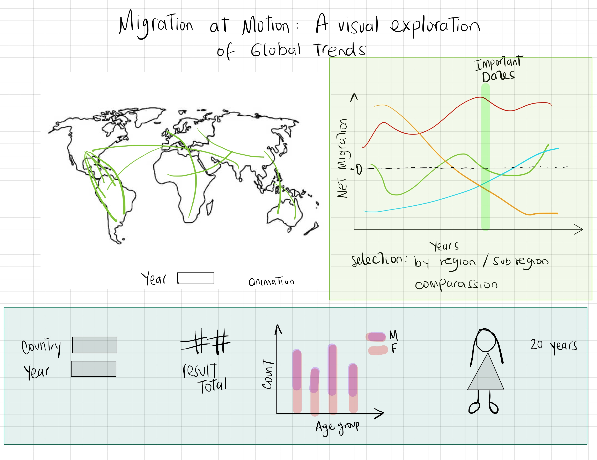

# Migration in Motion: A Visual Exploration of Global Trends 

---

**Name**: Paula Cadena

---

## Description

This project aims to visualize global migration trends, highlighting the flow of migrants between countries over time. By providing interactive features that allow users to explore migration data by country, year, and projected future trends, the visualization will help audiences understand migration patterns and the socio-economic factors driving these movements. Users will be able to:

1. View migration flows on a global map, showcasing movement between countries and years.
2. Select specific countries and years to examine detailed data on the number of migrants and their origin/destination countries.
3. Analyze trends in net migration over time, including projections, to better understand migration’s impact on both origin and destination countries.

The project will utilize **Option B: Dynamic Ensemble**, combining multiple interactive charts and a map to create a cohesive interactive experience.

---

## Data Source

- **UN International Migrant Stock**: [UN DESA - International Migrant Stock](https://www.un.org/development/desa/pd/content/international-migrant-stock)  
   - *Description*: Data on the estimated number of international migrants by country and region (both origin and destination), disaggregated by age, sex, and other characteristics.
  
- **UN Population Projections**: [UN Population Projections](https://population.un.org/wpp/Download/Standard/MostUsed/)  
   - *Description*: This dataset provides population projections from 1950 to 2100 including migration details.

- **Mapbox API (Possible)**: [Mapbox API Documentation](https://docs.mapbox.com/api/overview/)  
   - *Description*: A robust mapping API for creating interactive, dynamic maps that are being used to visualize migration routes and trends. Mapbox's features will help depict global migration routes with customizable styling and interaction.

---

## Examples - Option B: Dynamic Ensemble

### 1. Map with movement illustrating migration between countries
- **URL**: [Altair - Airport Connections](https://altair-viz.github.io/gallery/airport_connections.html)
- **Description**: This example shows how lines can represent routes between points, similar to migration paths between countries. For migration, each line will represent flows between an origin and a destination country, and the thickness of the line can indicate the volume of migrants. Users will be able to click on specific countries to highlight inbound or outbound flows.

### 2. Country and year selection to view migration statistics
- **URL**: [NYTimes - Climate Change in Your Hometown](https://www.nytimes.com/interactive/2018/08/30/climate/how-much-hotter-is-your-hometown.html)
- **Description**: Inspired by this interactive, the migration visualization will include dropdowns for country and year selection. Users will be able to choose a country and year to see detailed data, such as the number of migrants and top origin/destination countries for that year. This feature could show statistics through a side panel or popup when a country is selected on the map.

### 3. Net migration graph by year and country with projections
- **URL**: [Altair - Falkensee Population Forecast](https://altair-viz.github.io/gallery/falkensee.html)
- **Description**: A line graph depicting net migration by year, allowing users to see migration trends over time. This visualization would include options to toggle between past data and future projections, offering insights into expected migration trends based on UN projections. Users could select specific countries to overlay different data, comparing how migration has changed over the years.

---

## Questions

1. Would D3.js be better suited for this project over Altair for customization?
2. Is it advisable to handle projections differently from actual data within visualizations to make the distinction clearer?
3. I had another idea for the second visualization: instead of just showing general migration trends, this selection would display a 'typical' migrant profile by year and country, along with additional data (e.g., for USA in 1950, it could show a female migrant, age 50, and an overview of migration distribution by age and sex). Would this approach of displaying a 'typical' migrant be more meaningful, or would a broader statistical overview be more impactful?

---

## Mockup
